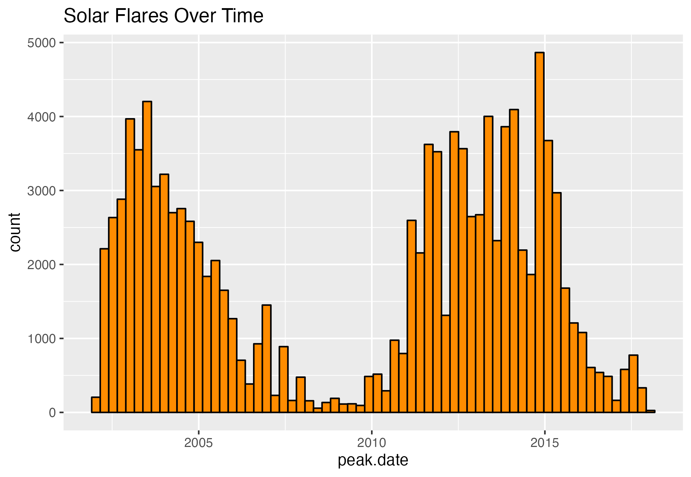
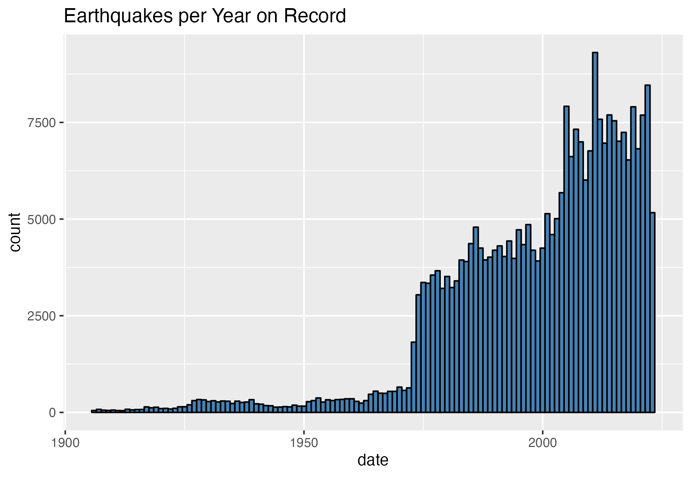
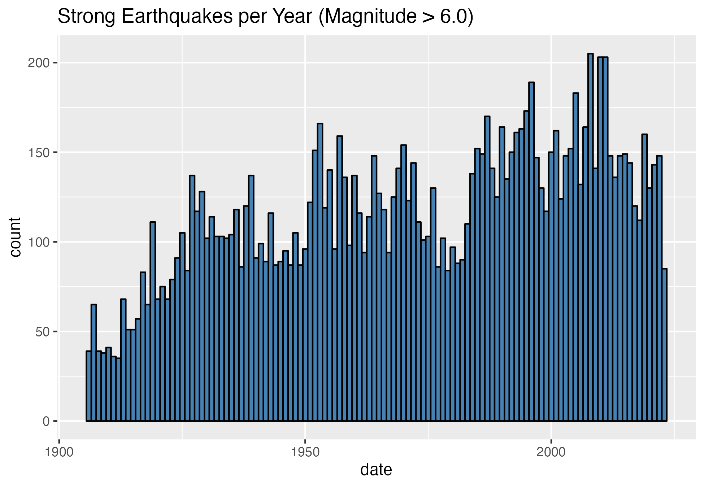
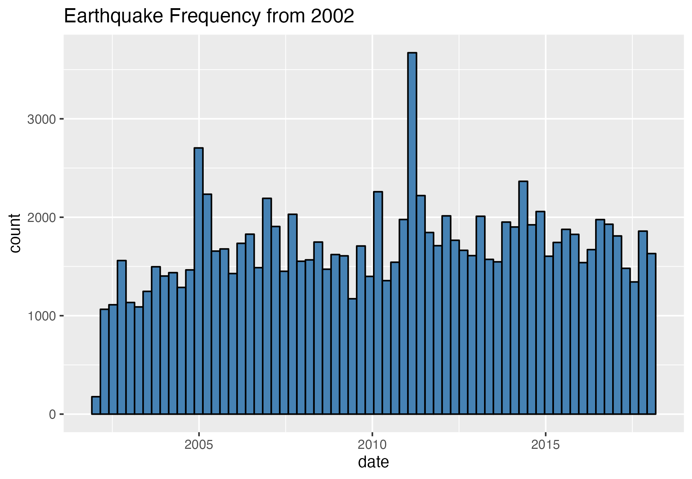
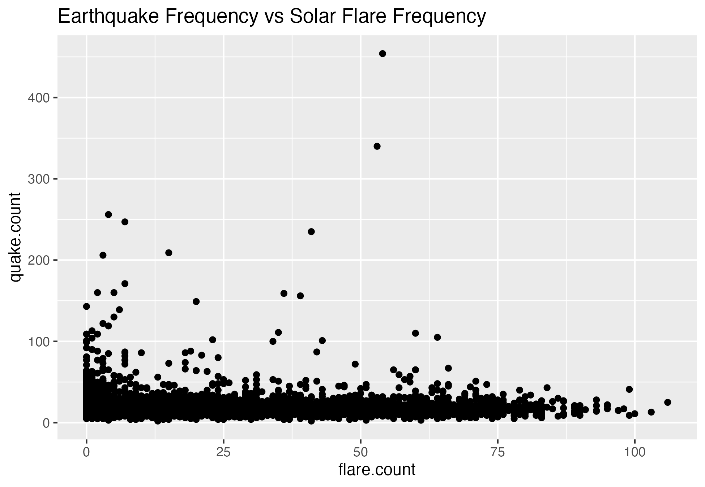

```{r setup, include=FALSE}
knitr::opts_chunk$set(echo = FALSE)
```

# Objective  

The purpose of this project was to explore the relationship, if any, between solar flare activity in the sun and earthquake activity on the earth.  

# Introduction
Recently there have been several significant earthquakes around the world. Turkey, Indonesia, Alaska, and Afghanistan were recently affected by earthquakes that caused major damage and injury. The US Geological survey has several areas of study in order to forecast and ideally predict the time and date, location, and magnitude of earthquakes ([USGS](https://www.usgs.gov/faqs/what-difference-between-earthquake-early-warning-earthquake-forecasts-earthquake-probabilities)). Unfortunately, earthquakes are tricky to forecast resulting in  continued disruption and loss in our society. If there were a way to better describe the patterns of earthquakes in a predictable way, we might be able to save lives and property in the future.  
One possibility for understanding earthquake patterns better is to study their relationship to solar activity. The solar cycle is an 11-year swing in the Sun's activity, including a high-activity period (solar maximum) and low-activity period (solar minimum). This cycle is comprised of factors like the number and size of sunspots, coronal loops, and solar flares [Solar Cycle - Wikipedia](https://en.wikipedia.org/wiki/Solar_cycle). At the time of this project in 2023, we are approaching the solar maximum for this solar cycle. Is it possible that there is a link between the solar cycle and the earthquakes seen around the world?  
This project is an exploration of the connection between the number of solar flares and the number of earthquakes, and attempts to describe a statistical model for predicting earthquake frequency from solar flare frequency.


# Methods and Analysis
### *PROJECT STRATEGY*
The strategy for accomplishing this project included importing the data, cleaning the data into tidy format as needed, exploratory data analysis, wrangling the two data sets to align by date, and finally forming several prediction models and comparing those to each other.  
<br>

**DATA IMPORT**  
Two data sets were chosen for this project, one capturing solar flare data from the RHESSI mission and the other capturing data about earthquakes from the US Geological Survey (USGS). These data sets were separately downloaded from kaggle for analysis using RStudio, and the respective .csv files were read-in using the `readr` package of `library(tidyverse)`.  
<br>

*Solar Flares from RHESSI Mission:*  
https://www.kaggle.com/datasets/khsamaha/solar-flares-rhessi/data  
This data set is centered around the measurement of energy released from solar flares in the form of electron volts. It includes data on the number of solar flares and their attributes from 2002 to 2016.  
<br>

*World Earthquake Data From 1906-2022:*
https://www.kaggle.com/datasets/garrickhague/world-earthquake-data-from-1906-2022/data  
The earthquakes data come from the USGS, curated by Garrick Hague on kaggle. This data set includes data on earthquakes measured all around the world from 1906 to 2022. It includes the number of earthquakes and their magnitudes, etc.  
<br>

**DATA CLEANING**  
Data were arranged using the `dplyr` package functions. Non-relevant variables were removed for streamlined analysis and downstream modeling. Both data sets were wrangled to include a date column using `lubridate` package.  
This date was used to align and merge the solar flares data set and the earthquake data set for analysis and modeling.  
<br>

**MODELING**  
Ultimately, the motivation for this project was to try and predict a pattern for earthquakes from the activity of the sun. This was the driver for the models created. The frequency of solar flares was used as the predictor of earthquake frequency on a given date.  
An initial model using the average solar flare count per day was used to predict the frequency of earthquakes on that day. This model was the baseline for comparison for the other models.  
A linear model was generated. Also a k-nearest neighbors (kNN) model was selected for experimentation in order to represent a more complex algorithm than a linear model. Lastly, a random forest model was selected as a non-linear archetype for experimentation.  
Models were trained using the `caret::train` function from the `caret` package.  
The metric chosen for evaluating the models was the root mean squared error (RMSE).

### *DATA EXPLORATION AND ANALYSIS*  
<br>
**SOLAR FLARES**  
The solar flares data set was examined and viewed in order to assess the usefulness of the variables in the data set. It was observed that some of the data were not solar events and those data were removed prior to analysis. The peak of the solar flare corresponding to the maximum energy released was determined to be more relevant than the start or end time of the flare, and that attribute was selected for inclusion in the analysis. The date of the peak was taken as the date that the solar flare occurred on.  
The frequency of solar flares was calculated as the count of flares per day, visualized in the graph below.  
  
We see that the solar flare frequency follows the solar cycle, where more flares per day represent higher solar activity.  
The peak date of the solar flares was wrangled to a `ymd` date format and saved as a flares-per-day object for downstream modeling.  
<br>
**EARTHQUAKES**  
The earthquake data set was aligned with the solar flares-per-day data set by wrangling the date variable into a matching `ymd` date format. As with the solar flares data, the earthquake frequency was evaluated.  
  
The earthquake data set spans a larger timeframe than the solar flares data and includes other variables like magnitude and location, some of which were unnecessary for our analysis. The maximum daily magnitude of the earthquakes was used to stratify by above average and strong earthquakes over the years.  
  
A potential pattern was seen that vaguely mimicked the solar cycle when strong earthquake frequency was isolated. Further exploration revealed that the pattern was not significant.  
  
We see that when the earthquake dates scales were matched to the solar flares dates, the pattern disappears. This was confirmed through further exploration. The two data sets were combined by date and the frequencies of solar flares and earthquakes were plotted against each other.  
  
The correlation between the frequencies was evaluated and they appeared to be uncorrelated.  
```{r correlation, include=TRUE, echo=TRUE}
cor(solarquakes$flare.count, solarquakes$quake.count)
```
Additionally, the correlation matrix for the `solarquakes` frequencies data set showed no strong correlation for any of the variables.  
```{r correlation-matrix, echo=TRUE}
solarquakes %>% select(-date) %>% cor()
```
It was noted that there was some correlation between the daily maximum magnitude and the daily average magnitude of the earthquakes on a particulary day. However, this is not significant because the two variables are inherently related and we expect the average daily magnitude to increase as the maximum magnitude increases.  

### *MODEL GENERATION*  
The `solarquakes` data set was partitioned into training and testing sets for algorithm development. Twenty percent (p = 0.2) of the data was reserved for testing of the models as this gave a reasonably representative sample for validation.  
The RMSE was used to evaluated the model performance.  
```{r rmse, echo=TRUE}
RMSE <- function(actual_ratings, predicted_ratings){
  sqrt(mean((actual_ratings - predicted_ratings)^2))
}
```


An initial baseline model using **just the average** earthquake frequency to predict the quake counts gave a starting point for model comparison.  
Next, a **linear model** was trained based on the observed flares vs. quakes frequency scatter plot from data exploration.  
Thirdly, a **k-nearest-neighbors** model was selected to explore a non-parametric modeling algorithm. This model relies on proximity in order to determine any relationship between values. The k values was tuned and optimized and cross-validation was performed as part of the model training.  
Finally, a **random forest model** was generated to test for deeply complex relationships that may not be captured fully with linear regression. This model was also tuned and cross-validated to avoid over-training.  
All models were trained on the training data set and performance was evaluated on the test set data.  


# Results
The results of the model performance testing are shown in the table below.  
```{r model-results}
knitr::kable(models)
```
<br>
All models performed similarly on the SolarQuake data, showing similar RMSEs.  
Using the just average earthquake frequency as a predictor gave the best result at ```r just_avg_rmse```, followed closely by the linear model with ```r linear_rmse```.  
The kNN model gave a resulting RMSE slightly higher at ```r knn_rmse```.  
The random forest model was the worst performing of the four models with an RMSE of ```r rf_rmse```.  


# Conclusion
In conclusion, the frequency of solar flares is not a predictor of the frequency of earthquakes on a given day. This analysis demonstrates that there is not a strong enough correlation to predict earthquake counts solely based on solar flare counts.  
A linear model using solar flare frequency was generated that gave a similar RMSE result as using just the average earthquake frequency for prediction of earthquake frequency. This indicates that there is little relationship between the two variables.  
The scope of this project was limited to the exploration of solar flare and earthquake frequencies, but future study might be focused on expanding the solar activity variables to include solar flare duration, earth-facing direction of solar flares, and the intensity of the flares as they relate to earthquakes. The field of study is broad and complex, and more focused study of the relationship between solar activity and earthquakes may yield a better picture of how the two interact.

# References
1. USGS - https://www.usgs.gov/faqs/what-difference-between-earthquake-early-warning-earthquake-forecasts-earthquake-probabilities  
2. Wikipedia: Solar Cycle - https://en.wikipedia.org/wiki/Solar_cycle  
3. Solar Flares Data Set - https://www.kaggle.com/datasets/khsamaha/solar-flares-rhessi/data  
4. Earthquakes Data Set - 